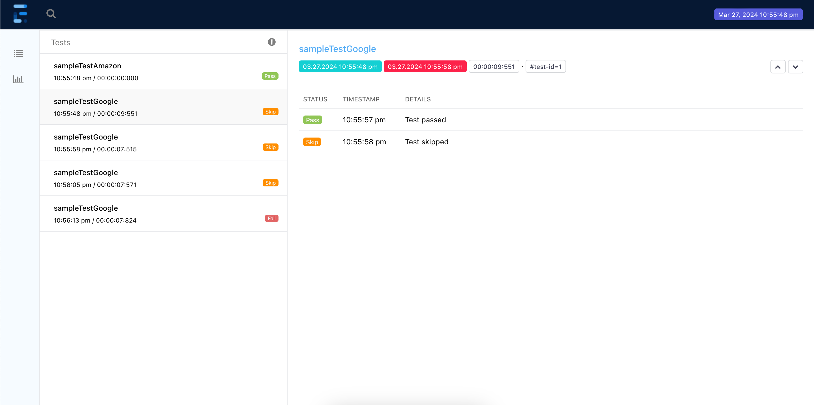
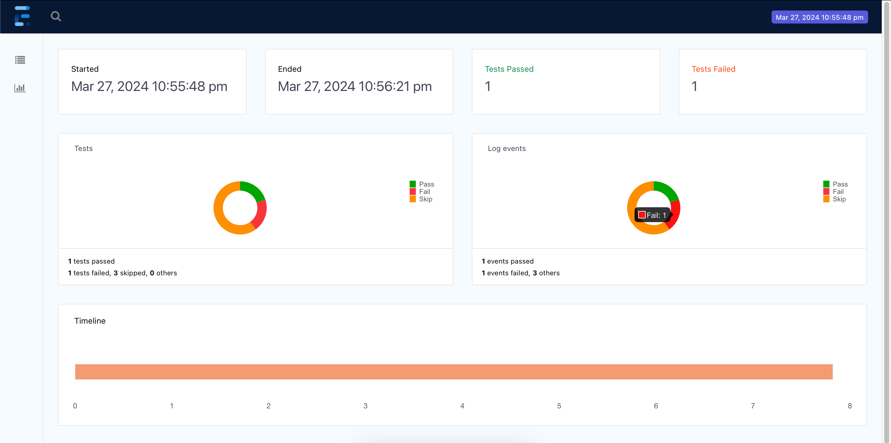

# Parallel Testing with Extent Reports and Retry Mechanism

## Overview

This project demonstrates how to run test cases in parallel using the Testing library. It utilizes threads to ensure each test is correctly attributed to its respective thread and continues through the flow seamlessly. Additionally, it incorporates the Spark report for detailed insights into each test and a comprehensive analysis of all executed tests.

The project also includes listeners and a retry mechanism to enhance test reliability and stability. Listeners are used to capture events during the test execution process, allowing for custom actions or reporting based on specific conditions. The retry mechanism automatically retries failed test cases to mitigate issues related to the environment or unexpected failures.

### Features

Parallel Testing

Executes test cases concurrently using threads to optimize test suite execution time. 
Leverages the Testing library to manage and run tests in parallel across multiple threads.

Extent Reports Integration

Utilizes Extent Reports to generate detailed HTML reports for test execution results.
Reports provide comprehensive insights into test status, logs, and exceptions encountered during execution.

Spark Reports

Integrates Spark reports to analyze test results and provide graphical representations of test outcomes.
Facilitates easy identification of test failures, trends, and overall test suite performance.

Listeners

Custom listeners capture events during test execution, enabling custom actions or reporting based on specific conditions.
Enhances test execution monitoring and facilitates better analysis of test execution flow.

Retry Mechanism

Includes a retry mechanism to automatically retry failed test cases.
Improves test reliability and stability by mitigating issues related to the environment or unexpected failures.

### Clone the repository:
> git clone https://github.com/SiddharthDalwaniya/parallel-testing-with-extent-reports.git

### Install dependencies:
cd parallel-testing-with-extent-reports
> mvn install

### Run the test suite:
> mvn test

## Access generated reports:
### Extent Reports: 
Open SparkReport.html in a web browser to view detailed test execution reports.
### Spark Reports: 
Navigate to the Spark Reports dashboard for a graphical analysis of test results.

## Contributing
Contributions & suggestions are welcome! If you happen to have any issues or have suggestions for improvements, please feel free to submit a pull request or open an issue.
